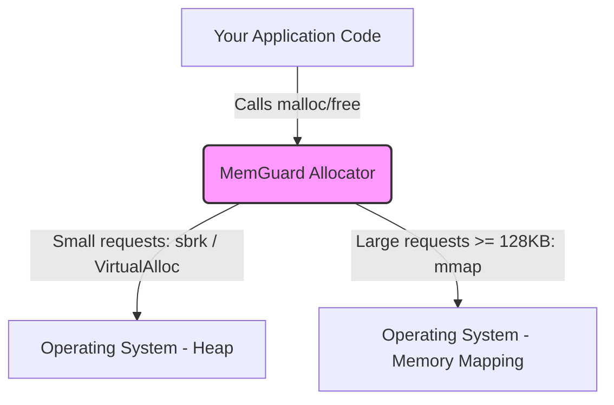
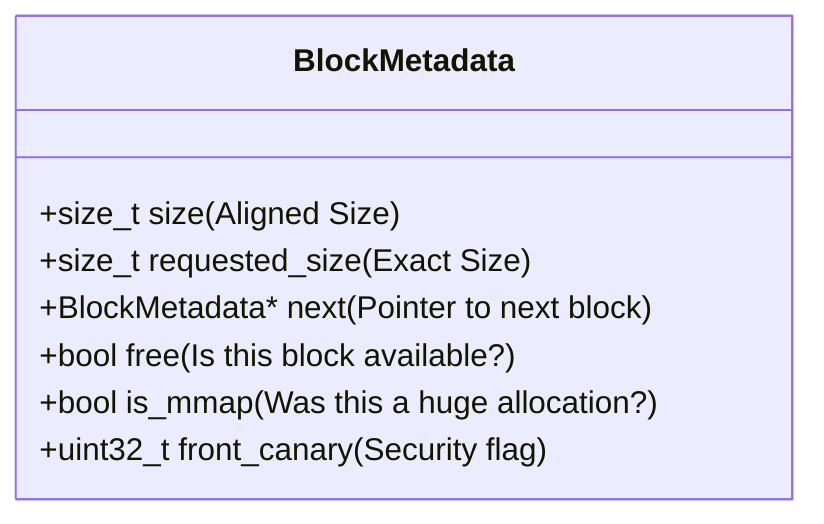

# MemGuard: Detailed Project Documentation

Welcome to the complete guide to **MemGuard**. This document is designed to explain the project from top to bottom so that anyone—whether you're a seasoned systems programmer or a beginner learning how computers work—can understand exactly what this project is, how it was built, and how it manages memory.

---

## 1. Introduction: What is MemGuard?
When you write a program in C, you constantly need to ask the computer for memory to store data (like text, numbers, or lists). Usually, you do this using a built-in function called `malloc()` (Memory Allocate). 

**MemGuard** is a custom, from-scratch replacement for `malloc()`. Instead of relying on the standard library provided by the C compiler, MemGuard handles the complex job of asking the Operating System for raw memory and efficiently slicing it up to give to your program. 

But MemGuard goes a step further than a basic allocator: it includes **security features (Canaries)** to detect if your program accidentally corrupts memory, and **statistics tracking** to monitor exactly how much memory your program is using in real-time.

---

## 2. System Architecture
At a high level, MemGuard acts as a "middleman" between your application code and the Operating System (OS). 

When your program asks for 50 bytes of memory, it doesn't make sense to ask the OS for exactly 50 bytes, because asking the OS for memory is a slow process. Instead, MemGuard asks the OS for a massive chunk of memory all at once. Then, MemGuard manages that massive chunk, slicing off 50 bytes to give to your program instantly.



### The Two Ways MemGuard Asks for Memory
1. **Small Allocations (`sbrk`):** For smaller requests, MemGuard uses `sbrk()` (or our Windows compatibility layer). This simply tells the OS, "Make my program's memory space a little bit bigger." MemGuard then manages this space using a Linked List.
2. **Large Allocations (`mmap`):** If you ask for a massive amount of memory (128 KB or more), MemGuard bypasses the Linked List entirely and uses `mmap()`. This asks the OS to map a brand new, dedicated page of memory just for this huge request. When it's freed, it goes straight back to the OS.

---

## 3. System Design: How Memory is Structured
To manage all these slices of memory, MemGuard needs to keep track of which slices are currently in use by your program, and which slices are "free" (available to be reused). 

It does this by attaching a hidden **Header (Block Metadata)** to every single piece of memory it gives you.

### Data Structure Diagram


When you ask for 50 bytes, MemGuard actually allocates **metadata + 50 bytes + rear canary**.

### Memory Layout Diagram

- **Metadata:** Tells MemGuard how big the block is and if it's free.
- **Canaries (`0xDEADBEEF`):** Magic security numbers. If your program accidentally writes 60 bytes of data into a 50-byte space (a "buffer overflow"), the *Rear Canary* gets overwritten. When you later try to free this memory, MemGuard checks the canaries. If they are changed, MemGuard triggers a "Heap Corruption Detected" alarm!

---

## 4. How It Works (The Core Mechanisms)

### 1. The Free List
MemGuard keeps a global list of all the memory blocks it has created. When you free a block of memory, MemGuard doesn't give it back to the OS (unless it's a huge `mmap` block). Instead, it marks the metadata `free = true`. The next time you ask for memory, MemGuard searches this "Free List" to find a block that is big enough to recycle.

### 2. Block Splitting (Reducing Waste)
What if you need 50 bytes, but the only free block MemGuard finds is 1,000 bytes? Giving you the whole 1,000 bytes wastes 950 bytes (this is called *Internal Fragmentation*).
Instead, MemGuard **splits** the block. It gives you 50 bytes, and creates a brand new metadata header for the remaining 950 bytes, marking that new block as "free".

### 3. Coalescing (Merging Free Blocks)
What if you free two 50-byte blocks that are sitting right next to each other? Later, if you need 100 bytes, you wouldn't be able to use them unless you glued them together.
When you call `free()`, MemGuard looks at the blocks next door. If they are also free, MemGuard **coalesces** (merges) them into one giant free block.

---

## 5. Workflow Diagram: The `malloc()` Lifecycle

Below is the logical workflow MemGuard follows every time your program calls `malloc()`:

```mermaid
flowchart TD
    Start([malloc(size) called]) --> CheckSize{Is size >= 128KB?}
    
    CheckSize -->|Yes| Mmap[Use mmap to allocate directly from OS]
    Mmap --> AddCanaries[Add Canaries & Return Pointer]
    
    CheckSize -->|No| Search[Search Free List for available block]
    
    Search --> Found{Found a block large enough?}
    
    Found -->|No| AskOS[Ask OS for more memory via sbrk]
    AskOS --> AddCanaries
    
    Found -->|Yes| TooBig{Is the block WAY larger than needed?}
    
    TooBig -->|Yes| Split[Split block into two pieces]
    Split --> AddCanaries
    
    TooBig -->|No| MarkUsed[Mark block as used]
    MarkUsed --> AddCanaries
    
    AddCanaries --> Finish([Return Pointer to User Program])
```

---

## 6. How the Project Was Built

### Tech Stack & Tools
- **Language:** C (C11 standard)
- **Compiler:** GCC (GNU Compiler Collection)
- **Build System:** Make
- **Compatibility:** Built originally for POSIX (Linux/macOS). A custom `windows_compat.h` layer was written to translate UNIX system calls (`mmap` and `sbrk`) into native Windows API calls (`VirtualAlloc`), allowing MemGuard to run perfectly on Windows.

### The File Structure
- `include/allocator.h`: The public "menu" that other programs read to know what functions MemGuard provides (like `malloc`, `free`, and `get_allocator_stats`).
- `include/windows_compat.h`: The translation layer that makes Linux memory commands work on Windows.
- `src/allocator.c`: The brain of the project. This is where all the logic for splitting, coalescing, and managing the linked list lives.
- `tests/`: A folder containing rigorous testing scripts that deliberately try to break MemGuard (by double-freeing memory or overflowing buffers) to ensure the Canaries catch the errors.

### Conclusion
MemGuard takes the "black box" of memory allocation and makes it transparent, efficient, and highly secure. By implementing its own metadata tracking, fragmentation management, and buffer overflow detection, it acts as a robust safety net for C programmers.
